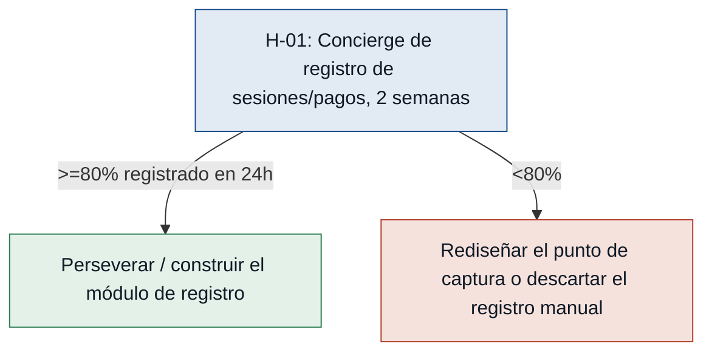

# Hipótesis y experimentos — CitaSalud

> Convierte los riesgos del MVP Canvas (`mvp-canvas.md`, sección "Riesgos /
> supuestos") en hipótesis falsables. Ordenadas de mayor a menor riesgo:
> primero se prueba lo que más puede tumbar el MVP.

## Árbol de decisión (ejemplo sobre H-01, el riesgo más alto)

---

### [H-01] Adopción del registro centralizado por el staff — riesgo: alto
- **Supuesto a probar:** que la recepcionista y el gestor administrativo
  actualizarán el registro centralizado de forma consistente, en vez de
  abandonarlo como hoy abandonan parcialmente el Excel.
- **Hipótesis:** Creemos que la recepcionista y el gestor administrativo
  registrarán sesiones y pagos de forma consistente si el registro
  reemplaza por completo sus herramientas actuales (Excel, papel) sin
  exigir doble tarea, porque hoy dejan el Excel a medias cuando se vuelve
  una carga adicional en lugar de un reemplazo.
- **Señal medible:** % de sesiones y pagos del mes piloto que quedan
  registrados dentro de las 24 horas de ocurridos, sin recordatorio
  manual.
- **Criterio de éxito:** ≥ 80% de los registros del mes piloto completados
  dentro de 24 horas, sin que el investigador tenga que recordárselo.
- **Experimento:** Mago de Oz / Concierge — 2 semanas registrando en una
  planilla estructurada que simula la ficha, sin construir el sistema
  real.
- **Caja de tiempo/costo:** 2 semanas; sin desarrollo, solo configurar la
  planilla (medio día).
- **Regla de decisión:** Si pasa (≥80%) → construir el módulo de registro
  tal como está diseñado. Si falla (<80%) → rediseñar el punto de captura
  (integrarlo a una acción que ya hacen, como el cobro o el envío del
  informe) antes de construir, o descartar el registro manual como
  mecanismo de entrada.

### [H-02] El recordatorio automático de pago acelera el cobro — riesgo: alto
- **Supuesto a probar:** que un recordatorio automático cerca del
  vencimiento reduce el tiempo de cobro sin generar rechazo en el
  paciente.
- **Hipótesis:** Creemos que los pacientes pagarán más rápido si reciben
  un recordatorio automático cerca de la fecha de vencimiento, en lugar
  del seguimiento manual tardío actual, porque hoy buena parte del atraso
  se debe a que nadie avisa a tiempo, no a que el paciente no quiera
  pagar.
- **Señal medible:** días promedio entre la fecha de vencimiento y el
  pago efectivo, y % de pacientes que se quejan del recordatorio.
- **Criterio de éxito:** reducir ≥ 30% los días promedio de atraso
  respecto al mes anterior, con < 5% de quejas.
- **Experimento:** Fake door / Mago de Oz — 4 semanas enviando
  manualmente el recordatorio simulado (plantilla fija) en la fecha
  exacta de vencimiento a un grupo de pacientes, comparando el tiempo de
  pago contra el grupo sin ese envío sistemático.
- **Caja de tiempo/costo:** 4 semanas; sin desarrollo, ~10 min/día de
  envío manual.
- **Regla de decisión:** Si pasa (reducción ≥30%, quejas <5%) →
  automatizar el envío tal como está diseñado. Si falla → revisar
  contenido/tono/canal del mensaje antes de automatizar, o descartar el
  recordatorio automático como palanca de cobro si la causa real del
  atraso no es la falta de aviso.

### [H-03] La ficha centralizada reduce el tiempo de respuesta del staff — riesgo: medio
- **Supuesto a probar:** que una ficha centralizada (sesiones, informes,
  pagos) reduce el tiempo/esfuerzo del staff para responder una consulta
  de seguimiento, frente a buscar en Excel/carpetas/preguntar a un colega.
- **Hipótesis:** Creemos que el staff resolverá una consulta de
  seguimiento de paciente sin salir de una ficha centralizada si esa
  ficha reúne los tres datos que hoy están dispersos, porque las tres
  entrevistas señalan que el tiempo se pierde saltando entre fuentes, no
  en la consulta en sí.
- **Señal medible:** % de consultas de seguimiento reales que el staff
  resuelve sin salir de la ficha (sin Excel, carpetas, mail ni preguntar
  a un colega).
- **Criterio de éxito:** ≥ 70% de una muestra de 20 consultas reales
  durante el piloto.
- **Experimento:** Prototipo desechable — maqueta clicable (o planilla de
  una sola vista por paciente) con datos reales de 5-10 pacientes, usada
  por el staff 1-2 semanas para responder consultas reales.
- **Caja de tiempo/costo:** 1-2 semanas; 2-3 días de construcción de la
  maqueta, sin backend real.
- **Regla de decisión:** Si pasa (≥70%) → avanzar a construir el sistema
  real con ese diseño de ficha. Si falla (<70%) → identificar qué dato
  falta y rediseñar la ficha antes de construir.

### [H-04] El control de acceso por rol no rompe el flujo de la recepcionista — riesgo: medio
- **Supuesto a probar:** que restringir el contenido de los informes a la
  recepcionista (solo metadata/estado de envío) no genera fricción que la
  obligue a pedir igual el contenido por otra vía.
- **Hipótesis:** Creemos que la recepcionista podrá gestionar el envío de
  informes sin ver su contenido sin que esto le genere fricción
  operativa, si el sistema le muestra todo el metadato que necesita
  (destinatario, fecha, estado), porque ella misma pide hoy no ver el
  contenido — el riesgo es que falte algún dato operativo que hoy obtiene
  mirando el documento.
- **Señal medible:** número de veces por semana que la recepcionista
  necesita pedirle a la psicóloga información que estaba en el contenido
  del informe porque el metadato no alcanzó.
- **Criterio de éxito:** ≤ 1 vez por semana durante las primeras 3 semanas
  de uso del prototipo.
- **Experimento:** Mago de Oz — 2-3 semanas en que la psicóloga entrega
  solo metadata de cada informe (sin contenido) a la recepcionista en una
  planilla; se registra cada vez que necesita pedir algo adicional.
- **Caja de tiempo/costo:** 2-3 semanas; sin desarrollo.
- **Regla de decisión:** Si pasa (≤1/semana) → construir el control de
  acceso tal como está diseñado. Si falla (>1/semana) → ampliar el
  metadato visible para la recepcionista (sin exponer el contenido
  clínico) antes de construir.
