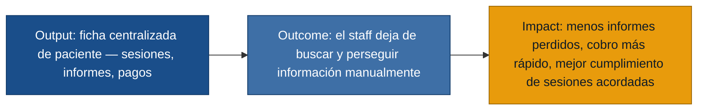

# MVP Canvas — CitaSalud

> Construido sobre `personas.md`, `requisitos.md` y `evidence-map.json` del
> discovery. Personas primarias con respaldo de primera mano: Psicóloga
> clínica, Recepcionista y secretaria administrativa, Gestor administrativo
> y contable. Paciente queda fuera del alcance primario (ver "Riesgos /
> supuestos" y `personas.md`).

## El puente output → outcome → impact

| Bloque | Contenido |
|---|---|
| Propuesta de valor | Una ficha de paciente centralizada —sesiones acordadas y cumplidas, estado de informes (sin exponer su contenido) y estado de pago— que reemplaza carpetas, Excel y seguimiento manual por WhatsApp, para que el staff deje de perder información y de perseguir pagos e informes a mano. |
| Segmento de usuarios | Psicóloga clínica, Recepcionista y secretaria administrativa, Gestor administrativo y contable: las tres personas primarias del discovery, con entrevista de primera mano. |
| Funcionalidades mínimas | (1) Ficha de paciente centralizada con datos básicos y estado activo/inactivo. (2) Registro de sesiones acordadas vs. realizadas. (3) Agenda de citas sin choques de horario + recordatorio automático de cita al paciente. (4) Repositorio de informes con control de acceso por rol (la recepcionista ve solo metadata/estado de envío, nunca el contenido). (5) Registro de estado de pago por paciente (sesión/paquete/cuotas) + recordatorio automático de vencimiento o atraso. |
| Resultado esperado (outcome) | El staff deja de buscar información dispersa en Excel, carpetas o mails, y de hacer seguimiento manual por WhatsApp: cada rol puede resolver una consulta de seguimiento (sesiones, informe o pago) consultando la ficha del paciente, sin salir de ella ni preguntarle a otro colega. |
| Métrica de éxito | % de consultas de seguimiento de paciente (sesiones, informe o pago) que el staff resuelve consultando la ficha del paciente, sin recurrir a Excel, carpetas, mails viejos o preguntarle a otro colega. Prueba ácida: si este porcentaje no sube, la decisión es replantear el diseño de la ficha (qué muestra, a quién) antes de seguir invirtiendo en más funcionalidades. |
| Riesgos / supuestos | (1) Centralizar la ficha reduce el tiempo/esfuerzo de búsqueda — no validado aún con un prototipo real. (2) La recepcionista y el gestor adoptarán el registro de forma consistente; hoy el Excel se actualiza "a veces" — si el hábito no cambia, la herramienta no resuelve el problema de fondo. (3) Paciente queda fuera del alcance primario: no hay entrevista de primera mano que confirme cómo recibiría o toleraría los recordatorios automáticos (canal preferido, frecuencia). (4) No está validado si el recordatorio automático de pago efectivamente acelera el cobro, o solo traslada el mismo mensaje a un canal distinto. |
| Fuera de alcance (por ahora) | Portal de autoservicio para pacientes (agendar/cancelar citas, ver sus pagos): sin evidencia de primera mano de un paciente. Dashboard financiero avanzado de horas vendidas vs. entregadas y facturado vs. cobrado (R-08 completo): se resuelve primero el registro base; el análisis fino depende de que esos datos ya existan centralizados. Integración contable/facturación automática con sistemas externos: no reportado como bloqueante inmediato en las entrevistas. Migración del archivo histórico de informes en papel: las entrevistas describen el problema hacia adelante (evitar que se sigan perdiendo), no la digitalización del historial. |

## Resumen de priorización

El núcleo de valor son los dolores que se repiten entre personas
(`falta-seguimiento-sesiones-acordadas` entre psicóloga y gestor;
`falta-control-acceso-informes` entre psicóloga y recepcionista;
`recordatorios-pago-tardios` entre gestor y recepcionista) más los que,
aunque reportados por una sola persona, bloquean directamente su trabajo
diario (`gestion-manual-citas-choques`, `registro-pagos-disperso`,
`datos-pacientes-sin-centralizar`). R-08 (analítica financiera fina) se
posterga porque depende de que el registro base exista primero.
