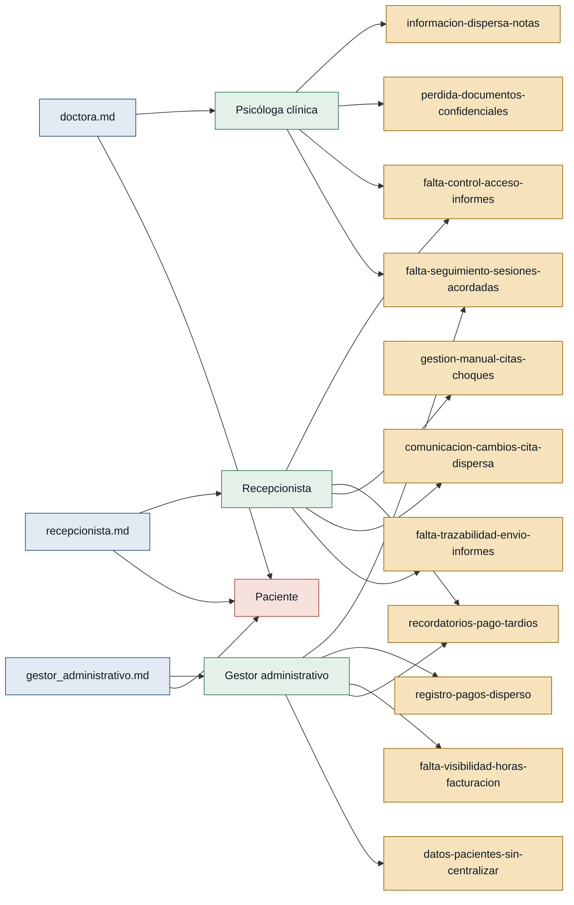

# Personas y stakeholders — CitaSalud

> Extraído de las entrevistas en `discoveries/citasalud/interviews/`. Toda
> afirmación cita su fuente. Regla dura: una persona `referenciada` no puede
> sustentar el MVP hasta tener entrevista de primera mano.

## Mapa de trazabilidad (entrevistas → personas → dolores)

---

## Personas

### Psicóloga clínica — profesional de salud mental
- **Contexto:** profesional que atiende pacientes en sesiones individuales,
  recurrentes (semanales o quincenales) (doctora.md).
- **Objetivo principal:** llevar un registro confiable y confidencial de cada
  paciente, y poder hacer seguimiento del cumplimiento de las sesiones
  acordadas, sin perder información (doctora.md).
- **Dolores:**
  - Información de sesiones e informes dispersa en carpetas del escritorio,
    el teléfono y distintos documentos, sin un lugar centralizado
    (doctora.md).
  - Pérdida de documentos confidenciales: un informe en papel desapareció y
    casi terminó en una demanda (doctora.md).
  - No puede compartir el envío de informes con la recepcionista sin que
    esta vea el contenido confidencial (doctora.md).
  - No puede ver fácilmente si un paciente cumple las sesiones acordadas
    (p. ej. "tres horas semanales durante seis meses") (doctora.md).
- **Respaldo:** `primera mano` (doctora.md).

### Recepcionista y secretaria administrativa — gestión de pacientes y agenda
- **Contexto:** punto de contacto con los pacientes: agenda citas, envía
  recordatorios y documentos, y hace seguimiento de pagos atrasados
  (recepcionista.md).
- **Objetivo principal:** coordinar la agenda sin choques de horario y
  mantener informados a los pacientes (citas, informes, pagos) sin tener
  que improvisar canales ni búsquedas manuales (recepcionista.md).
- **Dolores:**
  - Gestión manual de la agenda, con riesgo de que se superpongan horarios y
    cambios de último momento que hay que reacomodar a mano
    (recepcionista.md).
  - Comunicación de cambios de cita dispersa entre WhatsApp y mail, sin
    sistema unificado (recepcionista.md).
  - No tiene forma clara de confirmar si un informe fue enviado o llegó:
    tiene que buscar en mails viejos o preguntarle a la doctora
    (recepcionista.md).
  - Debe enviar informes sin poder (ni deber) abrirlos para verificar su
    contenido, por ser confidenciales (recepcionista.md).
  - Hace seguimiento manual y a destiempo de pagos atrasados, escribiendo
    uno por uno por WhatsApp o mail, con la incomodidad social que eso
    genera (recepcionista.md).
- **Respaldo:** `primera mano` (recepcionista.md).

### Gestor administrativo y contable — finanzas y facturación
- **Contexto:** lleva la parte financiera del consultorio: facturación,
  seguimiento de pagos y contabilidad mensual (gestor_administrativo.md).
- **Objetivo principal:** tener visibilidad real de horas vendidas vs.
  entregadas y de lo facturado vs. cobrado, y automatizar el cobro
  (gestor_administrativo.md).
- **Dolores:**
  - Registro de pagos disperso en un Excel que la recepcionista actualiza
    de forma inconsistente (gestor_administrativo.md).
  - Sin visibilidad real de horas vendidas vs. horas entregadas, ni de lo
    facturado vs. lo cobrado (gestor_administrativo.md).
  - Los recordatorios de pago son tardíos: depende de un reporte mensual de
    impagos y de que la recepcionista llame uno por uno
    (gestor_administrativo.md).
  - No hay registro centralizado del estado del paciente (activo/inactivo,
    fecha de inicio, recurrencia, datos de contacto) — todo es manual
    (gestor_administrativo.md).
  - No puede ver si un paciente cumple las sesiones acordadas porque no
    siempre recibe esos datos "limpios" desde la psicóloga
    (gestor_administrativo.md).
- **Respaldo:** `primera mano` (gestor_administrativo.md).

### Paciente — usuario final del servicio
- **Contexto:** persona que asiste a sesiones, recibe informes y realiza
  pagos por sesión, paquete o cuotas. Mencionado en las tres entrevistas
  (doctora.md, gestor_administrativo.md, recepcionista.md) pero sin
  entrevista propia.
- **Objetivo principal (inferido de menciones de terceros, no confirmado
  directamente):** recibir recordatorios de citas, sus informes a tiempo y
  claridad sobre sus pagos.
- **Dolores (reportados por terceros, no confirmados en primera persona):**
  - Pregunta por informes que no llegaron o no encuentra confirmación de
    envío (mencionado en recepcionista.md).
  - Recibe avisos de pago atrasado a destiempo y de forma poco clara
    (mencionado en gestor_administrativo.md, recepcionista.md).
- **Respaldo:** `referenciada` — no existe entrevista en primera persona de
  un paciente. **No puede sustentar el MVP** hasta conseguir esa evidencia.
- **Decisión de alcance:** ningún requisito candidato (R-01…R-12) exige que
  el paciente interactúe directamente con el sistema; toda interacción está
  mediada por el staff (recepcionista, psicóloga). Por eso, en
  `evidence-map.json`, Paciente queda marcada `primary: false` para este
  MVP: es una persona secundaria/afectada, no una persona primaria del
  alcance actual. Si en el futuro se quisiera un portal o canal directo
  para el paciente (p. ej. autoservicio de citas), antes habría que
  levantar una entrevista en primera persona de un paciente.

---

## Stakeholders

No se identificó, en la evidencia disponible, ningún actor con interés en el
sistema que no esté ya cubierto como persona (psicóloga, recepcionista,
gestor administrativo, paciente). Si existiera, por ejemplo, un dueño del
consultorio distinto de la psicóloga entrevistada, o un ente regulador de
protección de datos de salud, no hay entrevista ni mención que lo confirme:
no se incluye para no inventar evidencia.
